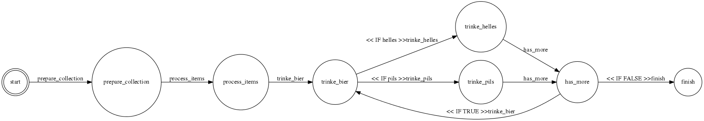

Mothership Magerun Addons 


=========================
This repository contains a list of extensions, which might be useful for your development workflow.


| Command 	| Description 	| Requirements 	|
|----------------------------------------	|---------------------------------------------------------	|------------------------------------------------------------	|
| [mothership:base:environment:dump](#mothership_base_environment_dump) 	|  	|  	|
| [mothership:base:environment:import](#mothership_base_environment_import) 	|  	|  	|
| mothership:base:feed:export 	|  	| mothership/feed_export 	|
| mothership:base:fixtures:product 	| Creates a yaml fixture file for ecomDev PHPunit test 	|  	|
| mothership:base:images:clean 	| Remove unused images from the catalog/product directory 	|  	|
| mothership:base:images:dummy 	| For each missing image, create a dummy file 	| Create a dummy file 	|
| mothership:base:images:missing 	| Identify missing images 	|  	|
| mothership:base:images:resize 	| Resize images 	|  	|
| mothership:base:reports:observerstimes 	|  	|  	|
| mothership:base:workflow:list 	|  	|  mothership/state_machine	|
| [mothership:base:workflow:render](#mothership_base_workflow_render) 	|  	|  mothership/state_machine, graphviz	|
| [mothership:base:workflow:run](#mothership_base_workflow_run) 	|  Runs a state machine defined by a workflow	| mothership/state_machine 	|

# Installation

There are currently three different ways to include the magerun-components. I will describe every method. Please check the offical [documentation](http://magerun.net/introducting-the-new-n98-magerun-module-system/) for further questions. The preferred method imho should be the composer way.

## Method 1 - the easiest one

This method needs you to have a home folder where all the custom modules will be located.

* Execute the following snippet

```
mkdir -p ~/.n98-magerun/modules/
```

* Clone the repository or symlink it. I prefer the symlink way as all my repositories are checked out in one place but this is up to you. The following example will clone the directory directly.

```
cd ~/.n98-magerun/modules/
git clone https://github.com/mothership-gmbh/magerun_mothership.git
```

## Method 2 - still easy, but more environment specific
While there is one way to centralize all your modules i prefer to have environment specific modules. 

* To achieve this, you just need to create a folder within your Magento project folder.

```
// replace MAGENTO_ROOT with your directory
mkdir -p MAGENTO_ROOT/lib/n98-magerun/modules
```

The next step is the same like before. Just clone and/or symlink the repository.

```
cd MAGENTO_ROOT/lib/n98-magerun/modules
git clone https://github.com/mothership-gmbh/magerun_mothership.git
```

## Method 3 - composer.json
just add this require to your *composer.json*. Please check the latest tagged version by yourself. 

```
"require": 
{
	"mothership/mothership_magerun":"<latest_tagged_version>"
}
```


# Commands

## <a name="mothership_base_environment_dump"></a>mothership:environment:dump

Dump all settings from the table ```core_config_data``` matching a given regular expression. Depends on a configuration file.

```
mothership:env:dump --
```

[read more ...](./doc/base_environment_dump.md)


##  <a name="mothership_base_environment_import"></a>mothership:environment:import

Import the configuration settings by overwriting the existing configurations. There is one example file ```settings.example.php```.
Just copy the file as ```settings.php``` and customize the settings for your needs.

 * File Structure

 You need to have some files in the directory ```Mothership\Environment\resource```. They should be named like ```environment_anyname```.
 If there is more then one file, name it like your environments. Please define one file as a fallback.
 
[read more ...](./doc/base_environment_import.md)
 
## mothership:images:create-dummy

This command will create an image file for each entry in the table ```catalog_product_entity_media_gallery```. Just ensure, that you have one file called ```dummy.jpg``` in your ```media``` directory. This can be useful if you have to deal with large product data but do not want to download a gigazillion large directory. 

For more fun, use the official Mothership Image.


## mothership:images:resize

Handy command, to minify the base-images. This will create a new directory named after the ```--dir``` parameter and create a smaller version of all existing images. Please be aware that in case you have a new image file with the same name, this command will not recognize that. In this case remove the existing file from the resized image directory and rerun the command

```magerun typehype:images:resize --dir=thumbnails --size=100```

## mothership:reports:observerstimes
This is a *magerun* command to create a *csv* reports to find all the events and relative observers called for each 
Magento page called in the browser during navigation.

[More doc](./doc/base_reports_readme.md)


```
magerun mothership:reports:observerstimes
```

## <a name="mothership_base_workflow_render"></a>mothership:workflow:render

Super fancy graph generator! Instead of running our state machines, you can also render them for easier debugging. 

The graph creation depends on [graphviz](www.graphviz.org/), so ensure that you have installed it first,
so that you can run the ```dot``` command. Use ```apt-get install graphviz``` in debian environments.


```
magerun mothership:workflow:render --config=Demo.yaml
```

The created graph will look like this one. Check the [source file](./src/app/etc/mothership/workflows/Demo.yaml)



And yes, you can run this workflow exactly like displayed in the graph. Check the next command.


## <a name="mothership_base_workflow_run"></a>mothership:workflow:run

Run a workflow from the directory ```<root>/app/etc/mothership/workflows```. This feature is very powerful and is being used in a lot of scenarios with a lot of
complexity. It basically depends on [Mothership State Machine](https://github.com/mothership-gmbh/state_machine) and is a helper to run a finite state machine in a Magento environment.

```
magerun mothership:workflow:run --config=yourworkflow.yaml
magerun mothership:workflow:run --config=yourworkflow.yaml --help
magerun mothership:workflow:run --config=yourworkflow.yaml --interactive
magerun mothership:workflow:run --config=yourworkflow.yaml --queue
```

In additition to the plain PHP state machine implementation, this command has the following features:

* Parses a new node in the workflow definition file.
* Interactive mode: Each option can be set with a dialog.
* Queue: Use the queue php-resque to run workflows in the background.

[More doc](./doc/base_workflow_run.md)

